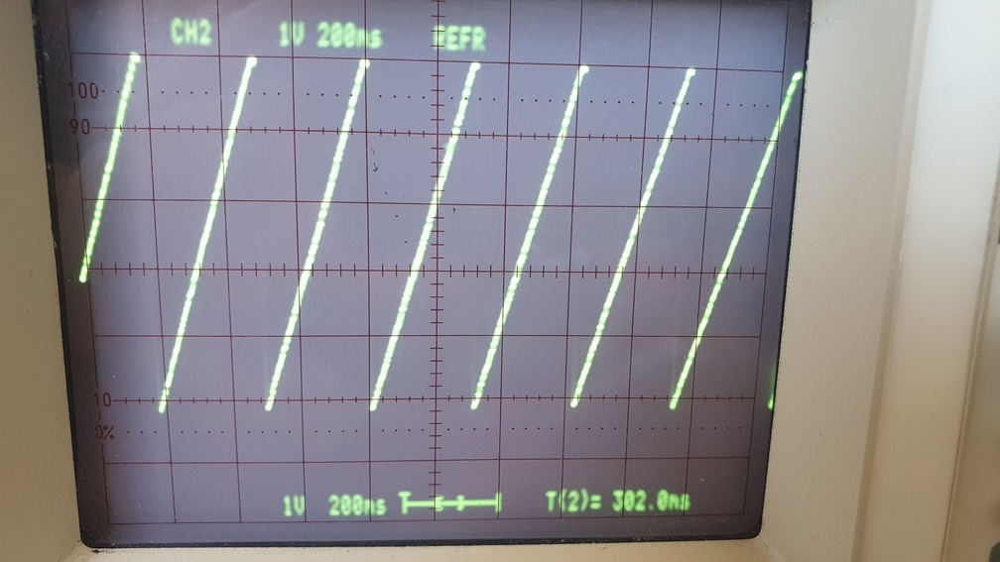
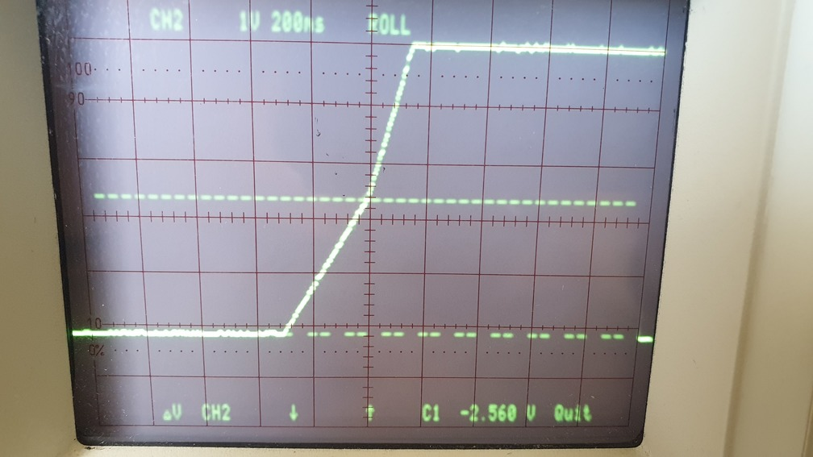

Let's take a look at this oscilo footages :

- 1:

It's `DAC_combination(2048, 1, 2)` with a delay after, its correct.

- 2:

It's `DAC_combination(1024, 1, 2)` with a delay after, its correct.

- 3:

It's `DAC_combination(0, 1, 2)` with a delay after, its correct.

- 4:

It's `DAC_combination(4095, 1, 2)` with a delay after, its correct.

- 5:

It's `DAC_combination(4095, 1, 2); DAC_rise(1)` with a delay after, its correct.

- 6:

It's `DAC_combination(0, 1, 2); DAC_rise(2)` with a delay after, its correct.

- 7:

It's `DAC_combination(2048, 1, 2);` by the arduino, its correct.

- 8:

It's `DAC_combination(4095, 1, 2);` by the arduino, its correct.

